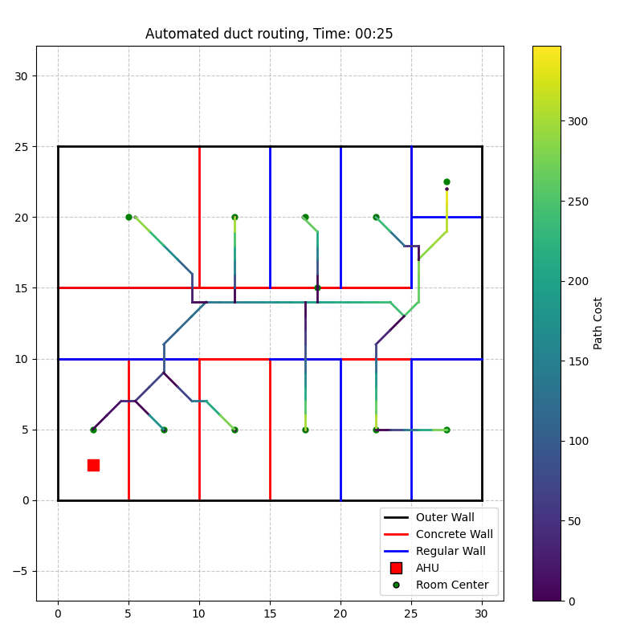

# Artery

Automatic drafting of duct and piping routings and column placement in buildings. Code is written by the use of python, with first examples created by Cline with Claude 3.5 Sonnet by Anthropic or ChatGPT o1 by OpenAI. 

## Problem formulation
The problem we want to address is that buildings are made by teams siloed by discipline, which is a natural result of human specialization. Because there's a limit to the time available to coordinate different disciplines, buildings are not holistically optimized. Each discipline have optimized their part and adjusted it according to the others. We want to optimize the building as one solution. This means finding the right form for all parts based on their importance and function in the building. This is insanely complex and were suspect only systems using intuition (read neural networks) will be able find solutions in a reasonable time.

The experts that make structures or hvac systems use their intuition to draft possible solutions. They then suggest them to the project members. Together they haggle and decide what's the best draft. Then they detail. The cost in compute for humans is similar to that of computers in the sense that exact evaluation of suggested solutions is impossible to do in a reasonable time.

>[!TLDR] Problem formulation
>We seek optimization of a building considering multiple disciplines together.

## How to install

### Prerequisites
- Python 3.13 or higher
- UV package manager ([installation guide](https://github.com/astral-sh/uv))

## Clone the repository and install locally:

```bash
git clone http://git.cowiportal.com/haly/Artery.git
cd Artery
uv venv
.venv\Scripts\activate
uv pip install -e .

```

Requirements:
- Python 3.8+
- NumPy
- SciPy
- NetworkX

### Simplification of the problem
The problem can be solved for any building with any geometry. For us to be able to train and test a NN with data we need to limit the complecity  so that we can create syntehic data for training. Sampling real 3D models is beoyond the scope of our project. 

We start using an pre-defined architecture and only consider ventilation and structure. We limit the scope to a one story building with flat a roof loaded with a load of $5 \space kPa$. The structure consist of a load baring slab (bi-directional) on beams simply supported by columns with total heigt of $4m$.

Floor layout with total width and length of $25m$ with $n \pm i$ rooms defined by architectural walls. Maximum and minimum floor space in one room is defined to $5\% \space to \space 40 \%$ respecively of the total floor area. 

Air ducts are only placed in the same height as the beams. Hence, they need to pass through the web of the beam.

By limiting the scope this way we reduce the amount of computation need to train an NN and we make it possible to generate problems and evaluate them using alorithms and simple rules. 

Our project is limited to about 125 man hours. This has resulted in a weakness in our proplem definition. It maybe overfitted to our solution in order to keep it simple while at the same time keeping optimization of the discipline interface non-trivial.

We may apporach the problem by placing ducts using taxicab geometry and a traveling salesman alorithm. We might add some constraints (like no penetrations in wall junctions) and then place the columns using simulated annealing given some other constraints.

### Fitness function
#### Fitness of the ventilation system
- Total length of the duct system

#### Fitness of the structure
Doing a complete FEA analysis for each fitness evaluation will require too much compute for our project. Assessing the fitness of a statically determinate system is quickest.  We have therefore chosen consider the beams as simply supported and use the resultants as a axial force on the columns.

The fitness is assessed by the following

- Number of columns

Constraints:
- Moment utilization of all members, constrained by $1.0$.
$$
\sum \frac{M_{Ed,i}}{M_{Rd,i}}
$$
- Shear utilization of all members, constrained by $1.0$.
$$
\sum \frac{V_{Ed,i}}{V_{Rd,i}}
$$

## Project Structure
Artery/
├── src/                    # Source code
│   ├── core/              # Core data structures and utilities
│   ├── MEP/               # Mechanical, Electrical, Plumbing related code
│   ├── structural/        # Structural analysis and calculations
│   ├── visualization.py   # Visualization utilities
│   └── routing.py         # Duct routing algorithms
├── tests/                 # Test files
│   ├── test_integration.py
│   └── test_pathfinding.py
├── results/               # Generated visualization outputs
│   └── results_combined
│   └── results_mep
│   └── results_presentation
│   └── results_structural
└── docs/                  # Documentation

# Examples:


Ventilation routing algorithm


Load distribution optimization.
